<picture>
  <source media="(prefers-color-scheme: dark)" srcset="./github-banner-dark.svg">
  <source media="(prefers-color-scheme: light)" srcset="./github-banner-light.svg">
  
</picture>

# 👋 Hi, I'm Daniel Hofheinz

**Have AI — Will Travel**

---

I build agentic systems — orchestration infrastructure that turns model capabilities into reliable output. Parallel execution with dependency ordering, quality gates, checkpoint recovery, multi-provider failover. The patterns generalize whether the output is code, images, audio, or whatever the problem requires.

## What I Build

- **Agentic Orchestration:** Multi-agent pipelines, sub-task decomposition, parallel execution with shared context
- **AI Tooling & Integration:** Model orchestration, prompt infrastructure, SDK extensions, workflow automation
- **Systems Infrastructure:** Python (FastAPI) for ML-adjacent work, TypeScript (Node/Fastify) for product systems, async-first, observable, production-hardened
- **Interfaces:** React, TypeScript, Tailwind — whatever the project requires

## Current Work

- Agentic pipelines with per-task context isolation and cross-agent coordination
- Prompt infrastructure — expansion, composition, style systems at scale
- Multi-modal workflows with fast feedback and observability built in

## Philosophy

The models do the generation; I architect the systems that make it useful.

---

小さく作って大きく動かす

