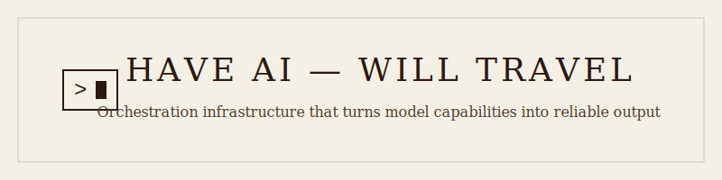

<picture>
  <source media="(prefers-color-scheme: dark)" srcset="./github-banner-dark.svg">
  <source media="(prefers-color-scheme: light)" srcset="./github-banner-light.svg">
  
</picture>

# 👋 Hi, I'm Daniel Hofheinz

**Have AI — Will Travel** · [danielhofheinz.com](https://danielhofheinz.com)

---

The model and the loop are commodities. The interesting work is everything around them: orchestration across agents in parallel, governance enforced as code, supervision at the seams where judgment decides, observability and control end-to-end. That's the layer I build. The patterns port across any domain where the output matters more than the mechanism.

## What I Build

- **Multi-Agent Orchestration:** Specification-driven pipelines that decompose work into dependency-ordered waves and run in parallel with cross-agent verification. Control planes for fleets of agents, not single models in a loop.
- **Governance & Supervision:** Evaluation gates between phases, policy enforcement at execution time, audit trails by default. What lets autonomous work happen inside processes that face real review.
- **Context & Memory:** Per-agent context engineering, retrieval boundaries, durable memory shaped to task. The substrate that decides whether multi-agent coordination converges or thrashes.
- **Systems Underneath:** Polyglot by workload (Python, TypeScript, Rust, Go). Async-first, observable, production-hardened. PII protection and encryption-at-rest where the work demands it.
- **Interfaces:** Stack follows the problem (React/Next, Svelte, native, whatever fits). With agentic workflows the language stopped being the bottleneck; design and system taste are the work.

## How the Work Goes

Specification before code; a system can't decompose what hasn't been written down. Evaluation as a first-class output, each pass calibrated by the last. Context engineered per agent, not shared as global state. Human judgment at the seams where taste decides; supervisor agents at the seams where policy decides. Logs as deliverables, not debugging exhaust. Nothing ships without a path to roll back. The result is autonomy that behaves like infrastructure: predictable enough to depend on, transparent enough to defend.

---

小さく作って大きく動かす
